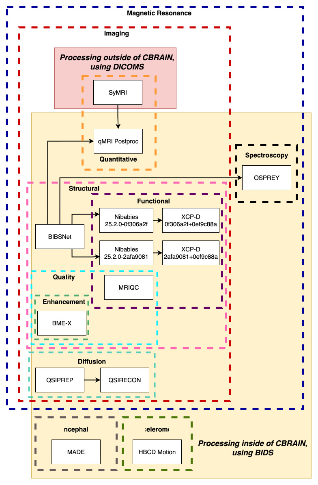

Tool Details Overview
=====================

The pages linked below provide detailed information about the tools used for HBCD data processing.
Each page includes descriptions of the processing arguments and lists of the input files required for execution.

These resources are intended as general references for users who wish to understand how HBCD processing is conducted.
All pages shown below are automatically generated from the processing configuration
files in the `HBCD_CBRAIN_PROCESSING repository <https://github.com/erikglee/HBCD_CBRAIN_PROCESSING>`_,
and versions of the Boutiques descriptors in CBRAIN.
For HBCD datasets processed within `CBRAIN <https://cbrain.ca/>`_, similar information is
also (for the most part) automatically saved out to the subject level or session level derivatives folder.
These locally generated files are derived directly from the actual processing tasks,
providing a more accurate and comprehensive record than the summary pages presented here.
If you are interested in learning about these files, please see :doc:`this page <hidden_proc_details_folder>`. 

Processing workflow
~~~~~~~~~~~~~~~~~~~

The following diagram highlights how the different processing tools are used together to generate
the outputs provided to users in the HBCD release.

Tool Names
~~~~~~~~~~