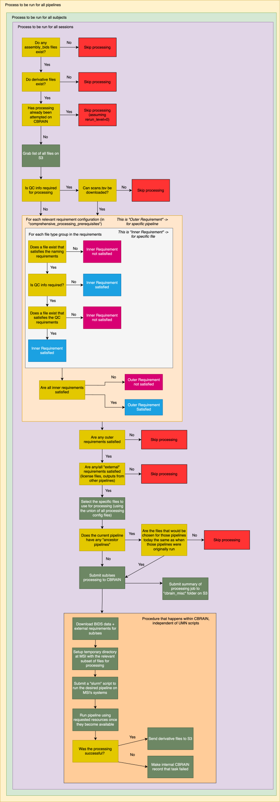

Workflow managing CBRAIN Processing
~~~~~~~~~~~~~~~~~~~~~~~~~~~~~~~~~~~

The following diagram highlights how the "update_processing" command operates. This function manages which subjects and sessions
are selected for processing within CBRAIN. If you are not a member of the HBCD Data
Cordinating Center, this diagram is likely not important for you.

The "update_processing" command found in the `HBCD_CBRAIN_PROCESSING repository <https://github.com/erikglee/HBCD_CBRAIN_PROCESSING>`_
will update processing for a given pipeline in CBRAIN. By "update processing" we mean that the S3 bucket
where all the BIDS data is stored will be queried to determine if any new processing should occur. This
process happens independently for each pipeline being ran within CBRAIN.

The current diagram is designed to describe the state of processing workflows as of October 21, 2025.

